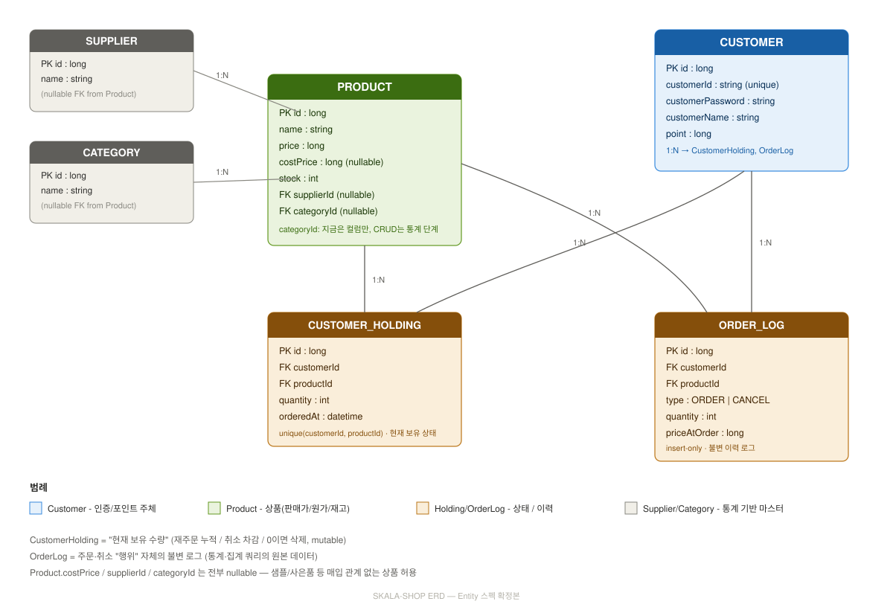

# SKALA-SHOP API

온라인 쇼핑몰 SKALA-SHOP의 백엔드 REST API입니다. 상품·고객·주문 관리를 계층형 구조(Controller–Service–Repository)로 구현했습니다.

---

## 1. 프로젝트 개요

| 항목 | 내용 |
|---|---|
| 서비스 | SKALA-SHOP — 온라인 쇼핑몰 백엔드 REST API |
| 핵심 도메인 | 상품(Product) · 고객(Customer) · 고객 보유상품(CustomerHolding) — 고객이 주문한 상품(1:N) |
| 사용자 | 쇼핑몰 고객 — 회원가입·로그인 후 상품을 주문 |
| 기능 범위 | 상품 CRUD · 고객 관리/인증 · 주문(담기) · 주문 취소 · 판매 통계 |
| 비즈니스 규칙 | 포인트 보유 한도 내 주문, 같은 상품 재주문 시 수량 누적, 로그인 필수 주문/취소, 입력 검증, 전역 예외 처리, 트랜잭션 원자성 보장 |

---

## 2. 배포 URL / 로컬 실행

**배포 URL**: `https://skala-test-spring.onrender.com/`

**Swagger UI**: `https://skala-test-spring.onrender.com/swagger-ui.html`

### 로컬 실행

```bash
git clone <repo-url>
cd shop
./gradlew bootRun
```

기동 후 `http://localhost:8080/api/products`로 정상 기동 확인 가능합니다.

### Docker 실행

```bash
docker build -t skala-shop .
docker run -p 8080:8080 -e SHOP_JWT_SECRET="local-test-secret-key-change-me" skala-shop
```

---

## 3. 기술 스택

| 구분 | 내용 |
|---|---|
| 언어 | Java 21 |
| 프레임워크 | Spring Boot 3.3.0 |
| 데이터 접근 | Spring Data JPA (CRUD/트랜잭션) + MyBatis (집계/통계 쿼리) 병행 |
| DB | H2 (인메모리) |
| 인증 | JWT (jjwt 0.11.5) + HttpOnly Cookie |
| 비밀번호 암호화 | Spring Security Crypto (BCrypt) |
| 캐싱 | Caffeine |
| API 문서화 | springdoc-openapi (Swagger UI) |
| 모니터링 | Spring Boot Actuator + Micrometer |
| 빌드 | Gradle |
| 배포 | Docker (멀티스테이지 빌드) |

---

## 4. ERD



- **CUSTOMER_HOLDING**: 고객의 "현재 보유 수량" — 재주문 시 누적, 취소 시 차감, 0이면 삭제 (mutable)
- **ORDER_LOG**: 주문/취소 "행위" 자체의 불변 이력 (insert-only, 통계 쿼리의 원본 데이터)
- **POINT_HISTORY / STOCK_HISTORY**: 포인트·재고 변동 이력 (회계원장 원칙, 5번 섹션 참고)
- **SUPPLIER / CATEGORY**: 매입처·분류 마스터 (nullable FK — 매입 관계 없는 상품도 허용)

---

## 5. API 목록

전체 요청/응답 스키마(필드 타입, 검증 규칙)는 Swagger UI(`/swagger-ui.html`)에서 확인 가능합니다. 아래는 빠른 접근을 위한 링크/curl 모음입니다. `BASE_URL`은 로컬(`http://localhost:8080`) 또는 배포 주소로 대체하세요.

### 조회(GET) — 클릭하면 바로 JSON 응답 확인

| API | 설명 | 링크 |
|---|---|---|
| 상품 목록 | 페이지 단위 상품 조회 | [`/api/products`](http://localhost:8080/api/products) |
| 상품 상세 | id로 단건 조회 | [`/api/products/1`](http://localhost:8080/api/products/1) |
| 상품별 판매 통계 | 순매출/마진 순위 | [`/api/stats/products`](http://localhost:8080/api/stats/products) |
| 일별 매출 추이 | 날짜별 순매출 | [`/api/stats/daily`](http://localhost:8080/api/stats/daily) |
| 카테고리별 판매 비중 | | [`/api/stats/categories`](http://localhost:8080/api/stats/categories) |
| 상품별 취소율 순위 | | [`/api/stats/cancel-rate`](http://localhost:8080/api/stats/cancel-rate) |
| 공급업체별 실적 | 매입 대비 판매 | [`/api/stats/suppliers`](http://localhost:8080/api/stats/suppliers) |

> 고객 조회(`/api/customers`, `/api/customers/{id}` 등)는 로그인이 필요해 링크만으로는 확인이 안 됩니다. 아래 curl 예시를 참고하세요.

### 쓰기(POST/PUT/DELETE) — curl 예시

```bash
# 회원가입
curl -X POST $BASE_URL/api/customers \
  -H "Content-Type: application/json" \
  -d '{"customerId":"skala01","customerPassword":"pw1234","customerName":"홍길동"}'

# 로그인 (Cookie 저장)
curl -c cookie.txt -X POST $BASE_URL/api/customers/login \
  -H "Content-Type: application/json" \
  -d '{"customerId":"skala01","customerPassword":"pw1234"}'

# 상품 주문 (로그인 필요)
curl -b cookie.txt -X POST $BASE_URL/api/customers/order \
  -H "Content-Type: application/json" \
  -d '{"productId":1,"quantity":2}'

# 주문 취소
curl -b cookie.txt -X POST $BASE_URL/api/customers/cancel \
  -H "Content-Type: application/json" \
  -d '{"productId":1,"quantity":1}'

# 상품 등록
curl -b cookie.txt -X POST $BASE_URL/api/products \
  -H "Content-Type: application/json" \
  -d '{"name":"신상품","price":10000,"stock":50}'
```

---

## 6. 인증 방식

- 로그인 성공 시 서버가 JWT를 발급해 `bff-access`라는 **HttpOnly Cookie**로 내려줍니다.
- 이후 인증이 필요한 API는 이 Cookie에서 JWT를 추출해 고객을 식별합니다 (`JwtAuthenticationFilter`).
- 인증 불필요: 회원가입, 로그인, 상품 조회(GET), 통계 조회
- 인증 필요: 그 외 `/api/customers/*` 전부 (목록/상세/수정/삭제/주문/취소), 상품 등록/수정/삭제

---

## 7. 설계 결정과 근거

### 7.1 도메인 모델링 — CustomerHolding과 OrderLog를 분리한 이유

처음엔 "고객이 보유한 상품 수량"만 관리하는 단일 테이블(OrderItem)로 시작했으나, 통계/이력 조회 요구가 생기면서 구조적 한계에 부딪혔습니다. OrderItem은 **현재 상태의 스냅샷**만 저장하고 변경 이력은 남기지 않는 구조였기 때문입니다.

- **CustomerHolding**: "지금 몇 개 보유 중인가" — 재주문 시 누적, 취소 시 차감, 0이면 row 삭제 (mutable)
- **OrderLog**: "언제 얼마나 주문/취소했는가" — 매 행위마다 새 row 추가, 절대 수정/삭제 없음 (insert-only)

두 테이블을 분리함으로써 "현재 상태 조회"와 "이력 기반 통계"라는 서로 다른 요구를 각각 최적화된 구조로 처리할 수 있습니다.

### 7.2 회계원장 원칙 — Product.stock / Customer.point는 이력의 합산과 항상 일치

`Product.stock`, `Customer.point`는 **직접 수정되는 값이 아니라, StockHistory/PointHistory의 합산으로 항상 도출 가능**해야 한다는 원칙을 지켰습니다.

- 상품 등록 시 초기 재고 → `StockHistory(PURCHASE_IN)`로 적재
- 주문 → `StockHistory(SALE_OUT)`, `PointHistory(ORDER)` 적재
- 취소 → `StockHistory(CANCEL_RETURN)`, `PointHistory(CANCEL)` 적재
- 상품 정보 수정으로 재고 변경 → `StockHistory(PURCHASE_IN 또는 ADJUSTMENT)` 적재 (증가/감소에 따라 구분)
- 회원가입 → `PointHistory(SIGNUP_BONUS)` 적재

이 원칙 덕분에 "왜 지금 이 값이 됐는지"를 항상 이력으로 추적할 수 있고, 초기 데이터 생성기(`generate_data.py`)도 이 정합성을 독립적으로 재검증합니다 (16번 섹션 참고).

### 7.3 동시성 제어 — 비관적 락

포인트 차감(`Customer.point`), 재고 차감(`Product.stock`), 보유수량 갱신(`CustomerHolding.quantity`)은 여러 요청이 동시에 접근할 수 있는 공유 자원입니다. 기본 트랜잭션 격리수준만으로는 동시 요청 시 update 유실(lost update)이 발생할 수 있어, `PESSIMISTIC_WRITE` 락을 명시적으로 걸었습니다.

```java
@Lock(LockModeType.PESSIMISTIC_WRITE)
@Query("select c from Customer c where c.customerId = :customerId")
Optional<Customer> findByCustomerIdForUpdate(@Param("customerId") String customerId);
```

**락 순서를 Customer → Product → CustomerHolding으로 `order()`/`cancel()` 양쪽에서 항상 동일하게 유지**해 데드락을 방지했습니다. 동시 주문 시뮬레이션 스크립트로 락 적용 전(정합성 깨짐 재현) → 적용 후(정상 반영)를 비교 검증했습니다.

### 7.4 예외 처리 체계

`ErrorCode` enum으로 모든 비즈니스 예외를 코드화하고, `BusinessException` 하나로 통일해 던집니다. `GlobalExceptionHandler`가 `ErrorCode` → HTTP 상태코드를 매핑합니다.

- 비즈니스 규칙에 의한 정상적 거부(포인트 부족, 재고 부족 등): `BusinessException` → 4xx
- 예상 못한 시스템 오류: 일반 `Exception` → 500 (마지막 방어선, 스택트레이스는 서버 로그에만 기록)

### 7.5 AOP 활용

- **감사 로깅(`AuditLogAspect`)**: 주문/취소 API 실행마다 `SUCCESS` / `REJECTED`(비즈니스 규칙 거부) / `FAILED`(시스템 오류) 3단계로 분류해 별도 로그 파일(`audit.log`)에 기록. 실행시간은 Micrometer `Timer`로 측정해 Actuator에 자동 노출.
- **멱등성(`IdempotencyAspect`)**: `Idempotency-Key` 헤더로 중복 요청을 식별해, 이미 처리된 요청이면 실제 로직을 재실행하지 않고 저장된 응답을 그대로 반환. 헤더가 없으면 기존 동작 그대로 유지(하위 호환).

### 7.6 캐싱 전략

상품 조회는 잦고 변경은 상대적으로 드물어 Caffeine으로 캐싱했습니다 (TTL 5분). **재고를 변경하는 지점(주문/취소/상품수정) 전부에 `@CacheEvict`를 걸어, 캐시와 실제 재고가 어긋나는 것을 방지**했습니다 — `OrderServiceImpl`이 `Product`를 직접 수정하므로, `ProductService`뿐 아니라 `OrderServiceImpl`에도 캐시 무효화가 반드시 필요했던 지점입니다.

### 7.7 MyBatis 통계 — JPA와 역할을 분리한 이유

JPA는 CRUD와 트랜잭션이 필요한 쓰기 작업(주문/취소)에, MyBatis는 집계 함수(SUM, GROUP BY, HAVING)가 많이 쓰이는 통계·리포트성 조회에 사용했습니다. 판매자 통계 5종(상품별 매출/마진, 일별 추이, 카테고리별 비중, 취소율 순위, 공급업체별 실적)을 이 방식으로 구현했습니다.

### 7.8 로깅 — MDC

`JwtAuthenticationFilter`에서 요청마다 `requestId`(UUID)를 발급하고 인증된 `customerId`와 함께 MDC에 저장합니다. 이후 해당 요청 흐름에서 발생하는 모든 로그(Controller, Service, 예외 핸들러)에 자동으로 `reqId`/`customerId`가 붙어, 로그를 `reqId` 기준으로 grep하면 한 요청의 전체 처리 흐름을 추적할 수 있습니다. 스레드 재사용 대비 `finally` 블록에서 반드시 `MDC.clear()`를 호출합니다.

---

## 8. 알려진 제약사항

- **Role 기반 인가 미도입**: 현재는 관리자/일반 사용자 구분 없이 인증 여부만 검사하는 열린 구조입니다. `Customer`에 role 필드 추가 + JWT 클레임 확장만으로 인가 체계를 얹을 수 있도록, 인증 로직(`JwtTokenProvider`, `JwtAuthenticationFilter`)은 이 확장을 염두에 두고 설계했습니다.
- **Micrometer Timer의 min 값은 근사치**: `order.service.duration` 메트릭의 최소 실행시간은 percentile(0.0) 기반 근사치이며, 정확한 min이 아닙니다. 완전히 정확한 min이 필요하면 별도 `DistributionSummary`/커스텀 Gauge가 필요하나, 현재 규모에서는 과도한 설계로 판단해 적용하지 않았습니다.
- **MyBatis 통계 쿼리의 H2 종속성**: 일별 매출 추이 쿼리에서 `FORMATDATETIME`(H2 전용 함수)를 사용합니다. 다른 DBMS로 이전 시 `DATE_FORMAT`(MySQL) 또는 `TO_CHAR`(PostgreSQL) 등으로 교체가 필요합니다.
- **H2 인메모리의 휘발성**: 배포 환경에서 컨테이너가 재시작되면 데이터와 `audit.log` 파일이 초기화됩니다. 데모/실습 목적에서는 매번 깨끗한 초기 상태로 시작된다는 장점으로 볼 수도 있습니다.

---

## 9. 초기 데이터

`data.sql`은 회계원장 원칙(재고/포인트가 각 이력의 합산과 항상 일치)을 지키도록, 손으로 SQL을 작성하는 대신 Python 생성기로 만들었습니다.

```bash
pip install bcrypt --break-system-packages
python3 generate_data.py
```

`generate_data.py` 상단 `CONFIG` 딕셔너리에서 규모(고객/상품/이벤트 수)와 랜덤 시드를 조절할 수 있습니다. 생성 후 **독립적인 검증 단계**를 거칩니다 — 생성 시 사용한 누적 변수를 그대로 믿지 않고, 최종 이력(OrderLog/StockHistory/PointHistory) 리스트에서 처음부터 다시 합산해 참조무결성·재고/포인트 정합성·holding 수량 일치 여부를 재확인합니다.

---

## 10. 테스트

### 10.1 JUnit (서버 기동 불필요)

```bash
./gradlew test
```

| 계층 | 대상 | 방식 |
|---|---|---|
| Repository | 락 쿼리(`@Query` + `@Param`) 문법 검증 | `@DataJpaTest` (H2 인메모리) |
| Entity | 포인트/재고/보유수량 상태변경 메서드 경계값 | 순수 단위 테스트 |
| Service | `OrderServiceImpl`의 재고부족/포인트부족/취소초과 등 예외 분기 | Mockito로 Repository 격리 |

애플리케이션 서버(8080)를 띄우지 않아도 `./gradlew test` 한 줄로 전부 실행됩니다.

### 10.2 통합 테스트 (서버 기동 필요)

```bash
./gradlew bootRun   # 먼저 서버 기동
./test_scenarios.sh     # 기본 CRUD/주문/취소/예외 시나리오 (24개 검증)
./test_audit_aop.sh     # AOP 감사로그 + MDC + Actuator 메트릭 (10개 검증)
```

실제 HTTP 요청으로 서버 전체 배선(필터, 인증, 캐시 무효화, 로그 파일 기록, Actuator 노출)까지 검증하는 블랙박스 E2E 테스트입니다. `test_audit_aop.sh`는 `logs/audit.log` 경로를 자동 탐색하며, 못 찾으면 인자로 직접 지정할 수 있습니다.

```bash
./test_audit_aop.sh /path/to/audit.log
```

---

## 11. Docker / 배포

멀티스테이지 빌드로, Gradle 빌드 단계와 실행 단계의 이미지를 분리해 최종 이미지 크기를 최소화했습니다.

### 환경변수

| 변수 | 필수/선택 | 기본값 | 용도 |
|---|---|---|---|
| `SHOP_JWT_SECRET` | **필수** | 없음 (미설정 시 기동 실패) | JWT 서명 키 |
| `SHOP_DEFAULT_POINT` | 선택 | 10000 | 회원가입 기본 포인트 정책 |
| `SHOP_JWT_EXPIRATION` | 선택 | 3600000 (1시간) | 토큰 만료시간(ms) |
| `PORT` | 선택 | 8080 | 배포 플랫폼이 자동 주입 |
| `SPRING_PROFILES_ACTIVE` | 선택 | 없음 | `prod`로 설정 시 H2 콘솔 비활성화, Actuator 노출 범위 축소 |

`SHOP_JWT_SECRET`은 의도적으로 기본값을 두지 않았습니다 — 값이 없으면 기동 자체가 실패하도록(fail-fast) 해서, 운영 배포 시 시크릿 설정 누락을 사전에 차단합니다.

### 배포 (Render)

1. GitHub 저장소 연결
2. Dockerfile 자동 감지
3. Environment Variables에 `SHOP_JWT_SECRET`, `SPRING_PROFILES_ACTIVE=prod` 등록
4. Health Check Path: `/actuator/health`